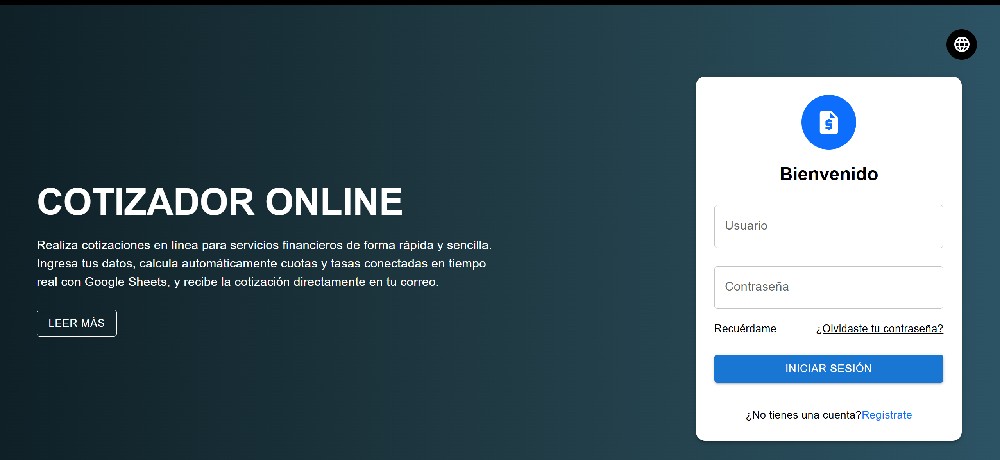
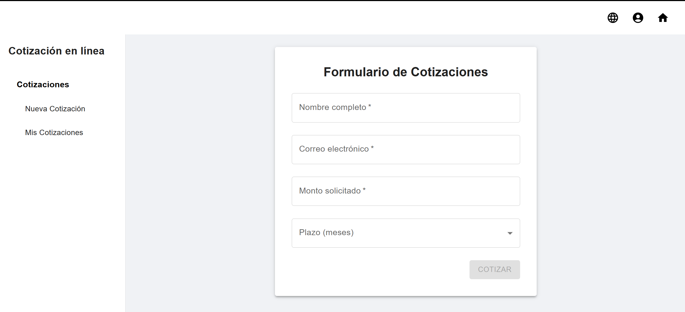
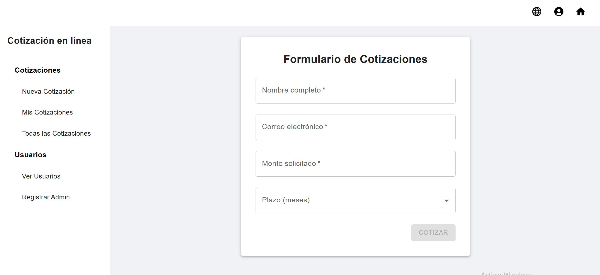
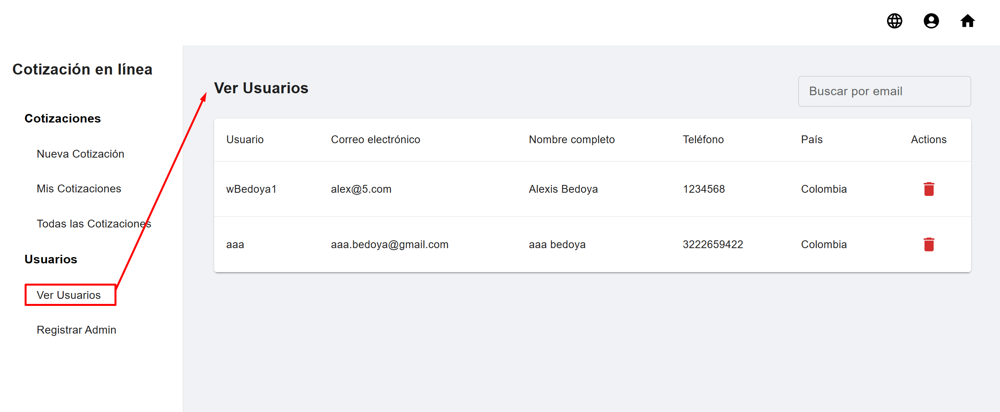

# 💼 Cotizador en Línea — Proyecto Full Stack

**Cotizador en Línea** es una aplicación web moderna que permite a los usuarios generar cotizaciones financieras personalizadas, conectarse con fuentes dinámicas como Google Sheets, y recibir notificaciones por correo electrónico. Desarrollado como solución completa en una arquitectura de microservicios.

---

## 🌐 Demo en línea

🖥️ [https://cotizador-wilson.onrender.com](https://cotizador-wilson.onrender.com)  
*(Versión desplegada — puede tardar unos segundos en iniciar por suspensión automática)*

---

## 📦 Tecnologías utilizadas

### 🔧 Backend
- Java 17, Spring Boot 3.x
- Spring Security + JWT
- PostgreSQL
- Google Sheets API
- Spring Mail
- Docker + Maven
- SpringDoc (Swagger)

### 🌐 Frontend
- React 19
- React Router DOM
- Material UI
- i18next (multilenguaje)
- Axios + JWT Decode
- React Hook Form
- Vite + Docker

---

## 🧪 Funcionalidades

- Registro y login de usuarios autenticados por JWT.
- Simulación de cotizaciones (tasa fija o desde Google Sheets).
- Historial personalizado por usuario.
- Envío de correos de confirmación.
- Panel protegido por rol.
- Frontend responsivo con soporte multilenguaje.

---

## 📸 Capturas de pantalla

### 🏠 Página Principal del Cotizador

### 👤 Vista de Usuario (cotizaciones)

### 🛠 Vista de Administrador

### 📊 Resultado de Consulta

### 📊 Mis Cotizaciones

---

## 🛠 Arquitectura general

Arquitectura basada en microservicios:

- `auth-service` → Autenticación y gestión de usuarios
- `quote-service` → Generación de cotizaciones y lectura desde Google Sheets
- `notifier-service` → Envío de correos HTML
- `frontend` → Interfaz web en React

Todo orquestado mediante Docker Compose.

---

## 📝 Nota sobre el código fuente

⚠️ El código completo de este proyecto es privado por motivos de confidencialidad, pero puede ser compartido **bajo solicitud directa** para procesos de revisión o evaluación profesional.

📧 Solicitudes a: **wilson.bedoyajs@gmail.com**

---

## ✍️ Autor

**Wilson Bedoya**  
Full Stack Developer | Backend Java | React  
📧 [wilson.bedoyajs@gmail.com](mailto:wilson.bedoyajs@gmail.com)
